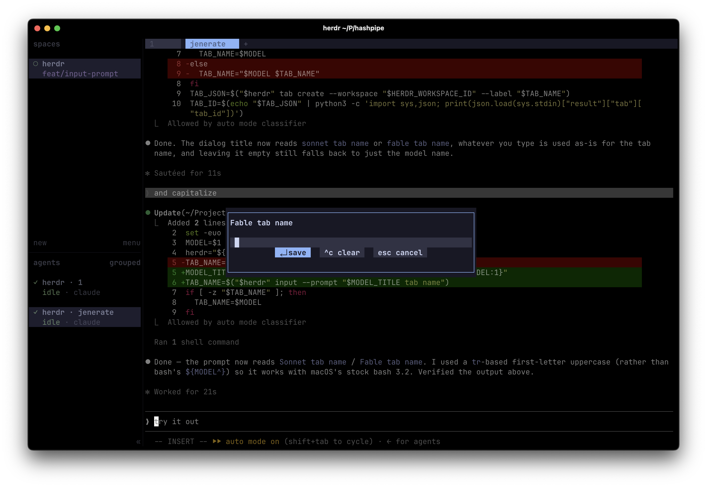

# Agent Launcher

Herdr plugin for opening a new named tab and running an agent command in it.

## Usage

Run `launch.sh` with the command to execute:

```sh
./launch.sh "codex"
./launch.sh "claude --model sonnet" "sonnet"
```

The first argument is the command Herdr should run in the new pane. The optional
second argument is the default tab name. If no name is provided, the launcher uses
the first word of the command.

When launched, the script prompts for a tab name. Leaving the prompt blank uses
the default name.

## Keybindings

Bind launchers to keys with `[[keys.command]]` entries in
`~/.config/herdr/config.toml`:

```toml
[[keys.command]]
key = "prefix+ctrl+s"
type = "shell"
command = "bash ~/Projects/herdr-agent-launcher/launch.sh 'claude --model sonnet' sonnet"
description = "open sonnet agent"

[[keys.command]]
key = "prefix+ctrl+f"
type = "shell"
command = "bash ~/Projects/herdr-agent-launcher/launch.sh 'claude --model fable' fable"
description = "open fable agent"
```

Pressing `prefix+ctrl+f` pops the inline input modal for the tab name, then
opens the tab and starts the agent:



The tab-name prompt uses `herdr input --prompt`, which currently only exists
in the [spro/herdr](https://github.com/spro/herdr) fork (the `input.prompt`
socket API); it has not landed in upstream herdr yet.

## Environment

The launcher expects a Herdr workspace ID from one of these variables:

- `HERDR_WORKSPACE_ID`, injected by Herdr plugin actions.
- `HERDR_ACTIVE_WORKSPACE_ID`, injected by shell keybindings.

The Herdr binary defaults to `herdr` on `PATH`. To use a different binary, set
`HERDR_BIN_PATH`.

## How It Works

`launch.sh` creates a tab in the current workspace, focuses it, and runs the
provided command in the tab's root pane.

The plugin metadata lives in `herdr-plugin.toml`.
